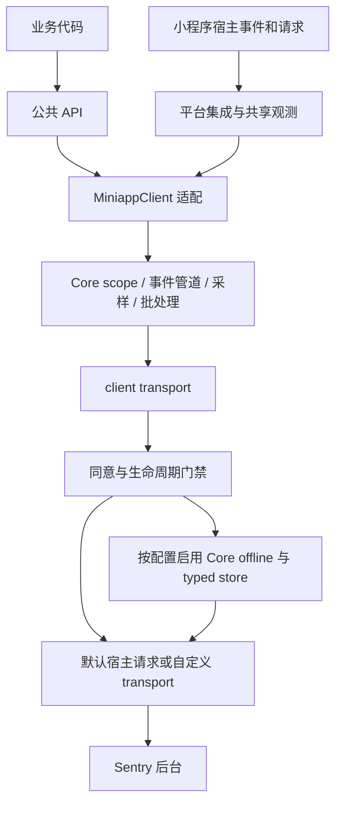
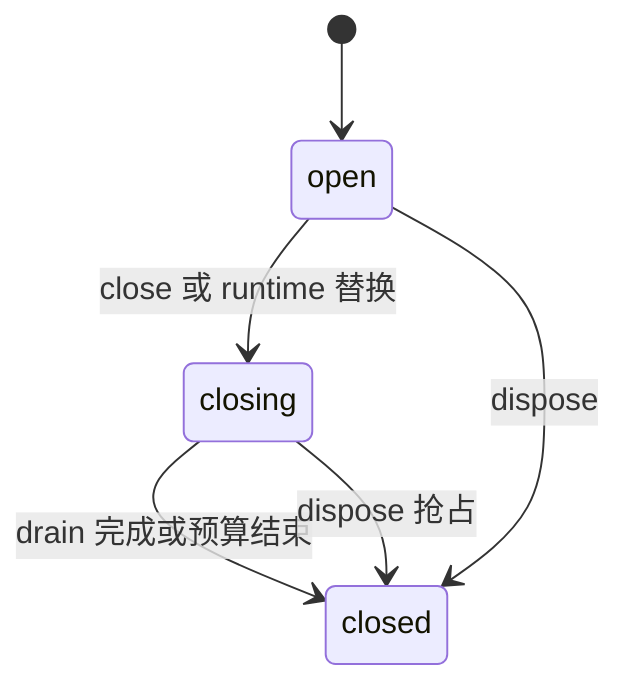

# Sentry Miniapp SDK 架构

本文面向 SDK 维护者和贡献者，说明 2.0 实现的职责边界、关键数据流和设计取舍。阅读后，应能判断一项能力应放在哪一层、哪些行为必须保留，以及改动需要哪些验证。

当前实现复用 `@sentry/core` v11；精确依赖版本以 [package.json](package.json) 为准。本文描述当前设计，版本验收证据分别保存在 [Core 升级审查](docs/core-v11-review.md)和[发布后审查](docs/core-v11-postrelease-review.md)。接入方式见[用户文档](https://sentry-miniapp.pages.dev/)，开发、调试和发版操作见 [DEVELOPMENT.md](DEVELOPMENT.md)。

## 1. 设计目标与支持边界

小程序宿主提供平台请求、存储和生命周期 API，没有可依赖的浏览器 DOM、`fetch` 或 `XMLHttpRequest`。部分宿主的 `window` 只是全局别名，不能作为浏览器能力判断。SDK 因而复用 Core 的遥测模型与处理管道，在宿主相关入口适配微信、支付宝、字节跳动、钉钉、QQ、百度和快手。

设计遵循四项约束：

1. **遥测算法继续由 Core 负责。** 事件准备、scope、采样、trace context、Session 状态和批处理不能各维护一套小程序实现。
2. **遥测观测尽量不改变业务语义。** 包装宿主函数须保留 receiver、返回值、回调参数和原异常；观测准备失败时降级，不能重试已经执行并抛错的业务请求。
3. **资源、权限和数据具有明确归属。** 一个活动的 `init()` runtime 管理自动采集与存储重放；退休的 SDK 自动观测回调不能向新 client 投递旧数据。
4. **能力缺失时明确降级。** 可选能力不能成为初始化前提；无法注册监听、不可读 getter、只读对象和缺少存储都有各自回退。

正式支持一个当前 runtime 和 Core 的默认异步上下文策略。并行任务跨 `await` 的父 span 隔离不作保证；自定义 async context strategy、多个长期并行自动 client、任意临时 scope 内重新初始化不在支持范围。直接构造 `MiniappClient` 是自管 transport 的低层入口，不获得 `init()` 的自动 runtime 权限。

## 2. 分层与模块职责

图中 transport 是 client 构造时装配的对象组合，并非所有配置都经过离线存储。正文观测的脱敏发生在网络／页面集成处；日志、span 和错误拥有各自的 Core 处理路径，共用发送边界。

| 职责                | Core                                                                               | sentry-miniapp                                                         |
| ------------------- | ---------------------------------------------------------------------------------- | ---------------------------------------------------------------------- |
| 公共 scope 与 trace | Scope、trace context、采样与 DSC                                                   | 重导出公共 API，提供宿主入口和操作归属                                 |
| 错误事件            | 准备、processors、normalization、beforeSend、错误采样、envelope                    | 小程序异常输入／栈解析、自动环境维度、采集时 Session 引用              |
| 性能、Logs、Metrics | stream span、日志和指标的处理与批量发送                                            | 请求／宿主性能观测及小程序维度                                         |
| Session             | 创建、更新错误状态、终态及 envelope                                                | App／原生前后台入口、会话归属和生命周期收尾                            |
| 传输                | `createTransport` 的序列化、限流和 buffer；`makeOfflineTransport` 的入库／重试管道 | 宿主请求执行、并发／超时／取消、同意与终态检查、Storage 适配           |
| Client reports      | 公开 drop recorder 调用与 `createClientReportEnvelope` 格式                        | 通过公开 recorder 累计自有批次，按宿主 flush／同意状态排放             |
| Source Map          | 事件 Debug ID 处理与标准 JS 事件模型                                               | 虚拟栈路径归一化、宿主 Debug ID carrier 桥接；后台符号化由 Sentry 完成 |

维护时可从这些入口沿调用链阅读，不需要先逐个阅读所有集成：

| 模块                 | 入口与作用                                                                                                                                  |
| -------------------- | ------------------------------------------------------------------------------------------------------------------------------------------- |
| 公共契约与初始化     | [index.ts](src/index.ts)、[sdk.ts](src/sdk.ts)、[types.ts](src/types.ts)：Core API 重导出、factories、选项和 runtime 装配                   |
| 启动兼容             | [polyfills-bootstrap.ts](src/polyfills-bootstrap.ts)、[polyfills.ts](src/polyfills.ts)：先于其它 SDK 静态依赖安装缺失能力                   |
| 宿主能力             | [crossPlatform.ts](src/crossPlatform.ts)：真实平台探测、API 与字段适配、小游戏识别                                                          |
| Client 与生命周期    | [client.ts](src/client.ts)、[lifecycle.ts](src/lifecycle.ts)：Core client 扩展、采集／发送／存储门禁、关闭资源                              |
| 操作和会话归属       | [owner.ts](src/owner.ts)、[sessionCapture.ts](src/sessionCapture.ts)：延迟操作 owner 与捕获时 Session 关联                                  |
| 环境维度             | [clientState.ts](src/clientState.ts)、[spanDimensions.ts](src/spanDimensions.ts)：client 自有环境状态，经 Core hook／processor 填充         |
| 共享观测             | [instrumentation.ts](src/instrumentation.ts)、[appLifecycle.ts](src/appLifecycle.ts)：全局函数包装和前后台协调通道                          |
| 采集集成             | [integrations/](src/integrations/)：宿主异常、请求、页面、Session、网络状态和可选性能 producers                                             |
| 数据处理与 Core 接缝 | [dataCollection.ts](src/dataCollection.ts)、[coreCompat.ts](src/coreCompat.ts)：自动采集字段过滤、正文策略和公共编码回退                    |
| 发送与离线存储       | [transports/](src/transports/)：宿主请求、同意门、Core offline 适配、typed records 和 envelope codec                                        |
| 映射与诊断           | [stacktrace.ts](src/stacktrace.ts)、[debugIds.ts](src/debugIds.ts)、[diagnostics.ts](src/diagnostics.ts)：栈输入、Debug ID 桥接及可解释诊断 |

## 3. 初始化与集成装配

公共入口先加载 `polyfills-bootstrap`，补齐缺失的运行时能力和 envelope 编码；它不替换已有的原生实现，也不随某个 client 的关闭卸载进程能力。

`init()` 的主要顺序是：

1. 检查遥测同步临界区和默认持久 scope；临时 `withScope`／`withActiveSpan`、尚未完成的异步 span 上下文返回 `undefined`，并保留原 client。同步采集 hook 重入同样拒绝初始化。
2. 校验只支持 `traceLifecycle: 'stream'`，判断宿主环境；装配全新的默认集成实例、用户集成、平台标签、stack parser 和 transport 配置。配置解析后再次检查根 scope 身份；配置回调或 getter 留下临时上下文时拒绝，尚不应用 `initialScope` 或退休旧 client。
3. 若旧绑定是 `MiniappClient`，开始其有界退休；再通过 Core 的公开 `initAndBind` 应用 `initialScope`、构造和绑定新 client。局部构造器在 `super` 前后检查同一根 scope：`initialScope` 改变上下文时不构造，transport 构造改变上下文时立即 dispose 尚未绑定的新 client。该守卫不复制 Core 的 scope 栈或装配算法。
4. Core 执行集成安装；client 自有环境、lifetime、consent 和 transport 控制闭包已经就绪。自动 runtime 的活动身份只授予 `init()` 构造的 client。

旧 runtime 退休后，新构造失败或构造阶段的 scope 拒绝不会复活旧 runtime。Core 绑定完成后，集成 `setup` 可以启动自身的异步 span；它完成后返回的根仍绑定新 client。根初始化可正常替换 client，但业务入口应尽早、通常在 `App()` 注册前初始化；晚初始化不能补回已发生的宿主注册和启动异常。

集成的公共形式是 factory，返回类型只承诺 Core `Integration`，不将内部 class 的清理方法作为公共 API。每次默认装配产生独立实例；Core 的 `setupOnce()` 只负责进程级安装，`setup(client)` 与 `client.registerCleanup()` 管理实例订阅。当前 Page、Console、Network 的 `setupOnce` 有实际包装消费者，不能按方法名称判断为空代码。

默认装配显式包含 `spanStreamingIntegration()`：自定义 `Client` 不会自动获得其它官方宿主 SDK 的集成组合。移除它后，业务 span 和请求 span 都不会经默认 stream 管道发送。性能 Observer 和 FPS 属于可选宿主能力，不能成为基础 HTTP tracing 的前提。

初始化边界由 [init-scope.realcore.test.ts](test/init-scope.realcore.test.ts)、[reinit.realcore.test.ts](test/reinit.realcore.test.ts)和[public-api.test.ts](test/public-api.test.ts)约束。

## 4. 事件处理与上下文归属

### 错误事件路径

公共捕获 API 仍通过 Core 路由到 client。`MiniappClient` 先检查采集终态，并准备采集时的 scope／Session 引用，随后调用 `super.capture*`。

在当前固定 Core 实现中，主要路径为：事件准备（含 `preprocessEvent`）→ 合并 scope、processors 与 normalization → `postprocessEvent` → 用户 `beforeSend` 与结果校验 → Session 错误更新 → 错误 `sampleRate` → `sendEvent`／envelope。Core 升级时须复核顺序；SDK 不复制这段 pipeline。

宿主 Debug ID 同步挂在公开 `preprocessEvent` 上。默认环境 processor 只填缺失维度，保留用户字段和显式 `null`。自动环境信息属于 client，不写共享 isolation scope，以免初始化、路由或关闭串改其它业务上下文。

SessionCapture 使用 hint 中的 Symbol 和 client 自有的事件 WeakMap 关联采集时引用；`postprocessEvent` 为 processors／normalization 的产物登记关联，`beforeSend` 返回替换对象时再次登记。`postprocessEvent` 本身是 void hook，不能用返回值替换事件。关联不向遥测 payload 增加 owner 字段，也不维护按 event ID 增长的索引。采集时没有 Session 也是有效结果，不能回落到处理完成时新建的会话。原 isolation scope 的身份与 `lastEventId()` 等 Core 副作用继续保留。

SDK 的操作快照通过 Core 公开的 scope processing metadata 保存明确的会话选择，包括空引用；嵌套 `withScope()` 的克隆仍保留该选择。普通业务 scope 未携带 SDK 归属时继续使用 Core 的 current／isolation 查找次序。长期 producer 和 Performance mark 显式更新当前策略，不能继承外层旧操作的捕获意图；内部 metadata 不进入最终 envelope。

Session 的错误状态沿用 Core 的首次 errored／unhandled 语义，`errors` 不是 SDK 每条异常累加的计数器。已经结束的会话不会被迟到的错误重新打开，旧终态不重发，也不把该错误补计到新会话；错误事件自身仍按配置处理。

### 延迟操作与长期 producer

`OwnerToken` 固定安装／操作时的 client 与 scope 数据，并在执行时检查当前绑定、活动 runtime 和启用状态。正常回调在短暂的 Core scope 内完成遥测工作；不持有跨 `await` 的 SDK 全局锁。

| 场景                                     | Session 选择                                         | 目的                                     |
| ---------------------------------------- | ---------------------------------------------------- | ---------------------------------------- |
| 一次错误捕获及异步 processor／beforeSend | 捕获时的 Session 引用，包括明确为空                  | 防止处理完成后记到后来的会话             |
| 已调度 timer／rAF 任务、已发起业务请求   | 操作开始时快照                                       | 迟到的旧操作不抢占新会话                 |
| 长期 Minigame／FPS／Performance 观测     | 每次执行克隆 owner scope，使用当前 isolation Session | 安装于 A 的 producer 在 B 活跃时应计入 B |
| 自动设备、宿主与应用维度                 | client 自有快照／状态，经 Core 扩展点填充            | 不污染共享 scope，不改变业务显式维度     |

Performance 的 mark 分支还保留实际 delivery scope 的 active span 和业务数据，仅替换 Session，不修改原 scope。原样导出的手动 Session API 操作 Core current／isolation scope，并非 per-client 会话 facade；自动集成只清除它仍持有的同一引用。需要完整手动控制会话时应关闭自动 Session，不能据此假定手动与自动会话完全隔离。

关闭会释放 owner 引用；缺少宿主 `off*` 时，迟到的 SDK 观测回调通过活动门禁失效。原业务 timer／request 回调仍可运行，其中显式调用顶层捕获 API，或随后发生独立宿主错误时，仍可按当前 client 捕获。该机制解决 SDK 自己的自动观测归属，不取消业务回调，也不实现通用异步上下文隔离。

对应回归见 [client-capture](test/client-capture.realcore.test.ts)、[producer-session](test/producer-session.realcore.test.ts)、[performance-owner](test/performance-owner.realcore.test.ts)和[span-dimensions](test/span-dimensions.realcore.test.ts)。

## 5. 生命周期与共享宿主观测

### 包装和退订

共享 instrumentation 按宿主对象和函数维护 wrapper 与 client handlers。调用时仅选择当前绑定且可自动采集的 client；退订只删除本 client 的 handler。最后一个 handler 退出时，仅在 SDK 仍直接拥有该 wrapper 的情况下恢复原函数，避免覆盖第三方后来加的包装。

宿主重新赋值后可迁移包装状态；旧 wrapper 留在第三方链内部时透明转发，防止重复分发。API 不可读或不可写时跳过该观测点。请求观测准备失败透传原 options，宿主原调用的异常保留且不重试。

Session／TryCatch 的资源清理由每个 client 的 lifetime stop 与公开 `registerCleanup()` 配对持有，不另设跨 client 的聚合清理入口或 Set。相应回归通过公开 `dispose()` 验证重复关闭、wrapper 恢复和迟到观测失效；内部清理闭包仍负责订阅与 owner 的实际释放。

### App 与小游戏的不同路径

普通小程序的共享 `App()` 包装保证：`before` → 业务同步 handler → `finally` 中的 `after` → `flush`。各阶段使用同一订阅快照，业务 handler 内安装的新 client 不接收旧事件的后半段；用户返回值和异常保留。这个次序不等待业务 handler 返回的 Promise。

无法包装 `App()` 时，可回退到宿主 `onAppShow`／`onAppHide` 原生通道；仍不能补回先前已发生的启动事件。

小游戏由 `isMinigame()` 判断，Session、可见性与 Minigame／FPS producers 使用原生 show／hide 共享通道，即使宿主存在第三方 App／Page shim 也不改变这些生命周期订阅的原生路径。它们共用 SDK 内部的 `before`／`after`／`flush` 次序；与其它原生业务监听器的先后仍由宿主决定。PageBreadcrumbs 单独检测实际 App／Page／导航 API，原生通道不提供页面或路由模型。

原生自动 Session 要求 show 和 hide 都能注册。两者成功后，在 Core `afterAllSetup` 建立初始前台会话；安装时已观察到 hide 则等待下一次 show。缺少任一方向则跳过自动会话并诊断，业务可显式管理 Session。

小游戏首帧只度量 SDK 安装至首次 rAF，不等同于完整冷启动。FPS 默认关闭，必须显式启用；缺 rAF 时跳过。后台状态用于 Session 收尾、停止帧队列和 flush，不等同于整个 client 已关闭。

### Client 关闭状态

client 的 `open / closing / closed` 与宿主的前台／后台可见性是两个维度。不能把一次退后台直接实现成永久关闭。

| 操作                    | 资源与数据语义                                                                                                |
| ----------------------- | ------------------------------------------------------------------------------------------------------------- |
| `flush(timeout)`        | 每次公开调用只进入一次 Core flush，并排放 client reports、请求离线重放；不退休 runtime                        |
| `close(timeout)`        | 一次 close operation 与总预算；退休自动 owner，同步收尾 Session／summary，停止 producers，再 drain 和 dispose |
| `dispose()`             | 同步关闭采集／发送／存储门禁，停止重放，结算 SDK 等待并清理资源；不作业务 summary 收尾                        |
| `init()` 替换旧 runtime | 旧 client 使用有限预算退休；新 client 独立取得自动采集和存储权限                                              |

close 的 `0`／未指定预算保留无期限 drain；非法预算会诊断并保守回落。closing 阶段拒收 exception／message／event／feedback 和 logs／metrics 的新采集，同步 finalizer 除外。`captureSession` 仅在 closed 时拒收，closing 仍接受该公共路径，以保留在途 Core 事件的会话更新；它不能区分这类更新与新的手动调用。业务须先停止创建新的手动 Session 和 trace：Core 公共 tracing 在 drain 期间仍可能触发 hooks／batch，发送最终受预算与关闭门禁限制。

dispose 能结束 SDK 等待，但不能强制取消用户 Promise 或任意自定义 transport 内部任务。Core hook 中 dispose 先关闭门禁，最外层 hook 返回后再完成清理，避免 hook 后续逻辑重新建立已退休资源。`flush()`／`close()` 返回 true 不证明 Sentry 后台已接收或完成符号化。

对应回归见 [instrumentation](test/instrumentation.test.ts)、[lifecycle-coordinator](test/lifecycle-coordinator.realcore.test.ts)、[native-session](test/native-session.realcore.test.ts)和[client-lifecycle](test/client-lifecycle.realcore.test.ts)。

## 6. 跨端能力与隐私发送边界

### 平台识别与降级

平台 API 始终取自实际探测的宿主对象。`miniappPlatform`（及兼容的旧 `platform` 选项）只覆盖 `contexts.miniapp.platform` 标签，不切换 request／Storage。事件顶层 `platform` 保持 `javascript`，让 Sentry 使用 JavaScript 堆栈与符号化语义。

系统信息按 API、字段独立读取，兼容分体 API 与旧接口；不修改宿主返回的冻结对象。某个 getter、可选 API 或字段失败，只省略／回退相关维度。网络 transport 安全探测 `request`，不可用时尝试 `httpRequest`；不同宿主的状态码、header、Storage 参数和二进制请求能力由适配层处理。

平台解析返回真实宿主对象，不安装 request 别名，也不原地替换 Storage 方法或写入适配标记。支付宝／钉钉的对象式 Storage 参数只在 SDK store 的消费入口转换，保留原生业务方法的身份、receiver 与返回结构；不可写宿主仍可用于 transport 和存储，无法安装的自动函数观测独立跳过。

新增宿主能力应先做实际 API 特性检测，并明确缺失时跳过、降级或拒绝的行为。平台列表不代表所有可选能力等价，详细差异由[平台能力文档](website/guide/platform-compatibility.md)维护。

### 采集、同意与持久化

这三个边界需要分别判断：

- **采集策略**：`dataCollection` 与正文开关约束 SDK 自动观察的数据；正文先识别 JSON／form 并过滤，再按 UTF-8 字节预算截断。未知文本、无法解析内容或 binary 不伪装成已脱敏正文。用户显式日志、extra 等内容仍需业务自己的数据策略。
- **网络授权**：`requireConsent` 控制实际发送，不等同于停止采集。`isEnabled()` 只表示 SDK 启用，授权使用 `getConsent()` 判断。默认请求在排队和执行前均检查同意与 lifetime，撤回后阻止新请求；在途取消依赖宿主能力。
- **持久化权限**：只有活动 runtime 可以使用 SDK store 和重放；目标、隐私策略、容量和 TTL 共同决定缓存可用性。

client 构造时选择 transport 组合，前三行适用于 `init()` 管理的 runtime：

| 配置                         | SDK 装配的离线层                                                                                          |
| ---------------------------- | --------------------------------------------------------------------------------------------------------- |
| `requireConsent: true`       | 默认或自定义 transport 都经过一个 Core offline 层；即使 `enableOfflineCache: false`，同意前缓存契约仍保留 |
| 无强制同意、默认 transport   | 默认启用弱网 offline；`enableOfflineCache: false` 可关闭                                                  |
| 无强制同意、自定义 transport | 不隐式添加弱网 offline；自定义实现自行管理其额外行为                                                      |
| 直接构造低层 client          | 不装配自动 store／replay；未授权发送直接阻止并诊断                                                        |

SDK 复用 `makeOfflineTransport` 管理入库和重试，只补 `shouldSend`／`shouldStore`、受控 store 与重放句柄。重放在授权、前台恢复、网络恢复或 flush 入口唤醒；不另写第二个 backoff 引擎，也不把 offline 重放当成持久 ACK。

typed records 保存目标／策略身份、最初 `createdAt` 和编码后的 envelope；重试保持记录身份与最初时间，按当前配置的 TTL 裁剪，不续期。Storage 不可用时可降级内存，不能承诺跨进程保留；读取重放记录必须先提交删除，再交付 transport。提交删除后中断仍可能丢失，重试也可能重复，故整体为 best-effort，不保证 durable ACK 或恰好一次。client reports 与明确不支持的 binary 请求不进入离线缓存。

SDK 自请求通过 [requestMarker.ts](src/transports/requestMarker.ts)识别，并配合 DSN／tunnel 目标检查跳过业务请求观测，避免上报再次触发上报。应保留标记在外层复制 options、缺少或残缺 `URL` 能力时的消费回归；不能仅靠 URL 字符串猜测所有自请求。

对应回归见 [platform-contracts](test/platform-contracts.realcore.test.ts)、[system-info](test/system-info.realcore.test.ts)、[networkbreadcrumbs](test/networkbreadcrumbs.realcore.test.ts)、[binary-transport](test/binary-transport.realcore.test.ts)、[consent-owner](test/consent-owner.realcore.test.ts)、[offline](test/offline.realcore.test.ts)和[envelope-codec](test/envelope-codec.realcore.test.ts)。故障语义的用户说明见[可靠性与隐私](website/guide/reliability-and-privacy.md)。

## 7. Core 的受控接缝与演进条件

优先使用 Core 公开扩展点；以下依赖集中登记，不能据此承诺兼容任意 Core 版本。当前保留两处 protected 方法适配、一项 protected 状态配置和一个内部过滤入口：

| 接缝                                    | 为什么保留                                                                                                                                  | 回归与移除条件                                                                                                                                                                               |
| --------------------------------------- | ------------------------------------------------------------------------------------------------------------------------------------------- | -------------------------------------------------------------------------------------------------------------------------------------------------------------------------------------------- |
| `MiniappClient._updateSessionFromEvent` | 只选择采集时 Session 后委托 `super`。公开 API 无法表达“采集时为空，不能回落到后来 Session”，不复制 Core 错误状态算法                        | [client-capture](test/client-capture.realcore.test.ts)、[session](test/session.test.ts)：异步替换／重入／并发与空 Session；Core 提供等价采集时关联接口后移除                                 |
| `MiniappClient._isClientDoneProcessing` | 在有限 Core tick 之间检查 dispose，取消无期限 processing 等待；单独 `Promise.race` 无法取消 Core timer，反复调用公开 flush 会重复业务 hooks | [client-lifecycle](test/client-lifecycle.realcore.test.ts)：永不完成 processor、无期限 flush／close、timer 与预算；Core 提供可取消等待后移除                                                 |
| `_unhandledSessionStatus = 'unhandled'` | JS 未处理异常不能作为宿主进程崩溃证据                                                                                                       | [session.realcore](test/session.realcore.test.ts)：错误状态与单次终态；Core 有等价公开宿主配置后替换                                                                                         |
| `coreCompat.filterKeyValueData`         | 唯一生产入口重导出 `_INTERNAL_filterKeyValueData`，过滤算法与 Core 保持一致，不复制内置敏感名单或放行 fallback                              | [data-collection](test/data-collection.test.ts)、[page-data-collection](test/page-data-collection.realcore.test.ts)：键值／URL／JSON／form 和最终 payload；公开过滤 API 可表达同等契约后迁移 |

UTF-8 编码与字节预算共用 `coreCompat` 的标量转换，缺少 TextEncoder 时通过 Core 公开 singleton 注册编码回退；不修改 Core 私有队列或 hooks。client reports 使用 SDK 自有 Map 和公开 recorder／envelope 入口，不读写 `_outcomes` 或调用 `_flushOutcomes`；发送前交换批次，发送 hook 新增的 drop 留到下次 flush，见 [client-reports](test/client-reports.realcore.test.ts)。

公开入口仍有需要验证的协议假设：`encodePolyfill` singleton 键、`_sentryDebugIds`／`_debugIds` 全局 map，以及 `getDefaultCurrentScope()` 对默认持久根的身份语义。升级时须同时检查缺编码器的线上字节、最终 `debug_meta` 和同步／异步临时 scope 的初始化回归，不能只登记 protected 方法。

操作 Session 标记还依赖当前 Core 的 scope metadata 克隆、两层 merge 和最终 envelope 移除 `sdkProcessingMetadata` 的语义。holder 放在 merge 深度之外，不通过私有 scope 字段传播；升级 Core 时须重跑 [producer-session](test/producer-session.realcore.test.ts) 和 [client-capture](test/client-capture.realcore.test.ts) 的空会话、当前策略与最终 payload 回归。

不以“零 protected”作为重构目标，也不恢复旧 class 集成、static transaction 管道或复制 Core buffer。评判替换实现的依据是：是否减少重复算法、能否保留可观察语义，以及是否缩小升级时需要复核的接缝。与同版本 Browser、Node、Deno、Cloudflare 的实践对照及本项目取舍见[官方 SDK 对照](docs/sdk-official-practices.md)。

升级 Core 必须阅读候选源码的签名、调用顺序和实现差异，检查上述接缝、公开 hook、stream 格式、offline 行为与编码契约，并运行真实 Core 和实际发布包回归。类型检查通过不能替代行为验证；调整精确依赖和结论应一并写入升级 PR。

## 8. 构建、映射与发布的职责关系

标准 npm 构建产生 ESM／CJS／UMD 与声明，微信示例构建产生独立 CJS 与 map。两类运行时代码都内联 Core；声明仍引用 Core 类型，因此依赖保持精确固定。生成目录不作为源代码维护，入口与消费一致性由 [vite.config.mjs](vite.config.mjs)和[包消费检查](scripts/internal/check-package-consumers.mjs)约束。

Source Map 链路跨越三个责任方：

1. **SDK 运行时**：解析宿主栈、用 RewriteFrames 归一化 `app:///` 路径、把非 globalThis 的 Debug ID map 桥接给 Core。
2. **业务构建与部署**：保留实际发布的 JS 与同次构建的 map 和 Debug ID／release，处理微信外层合并映射并上传到目标 Sentry 项目。map 用于上传验收，不要求随业务 JS 向用户公开发布。SDK 的 [doctor](scripts/doctor-sourcemap.mjs)只做本地检查，[merge](scripts/merge-sourcemap.mjs)只做离线映射合成；部分匹配成功不能代表所有 frame 可还原。
3. **Sentry 后台**：接收事件、匹配上传文件并完成符号化。HTTP 成功、本地映射成功与后台还原成功是不同证据。

npm 发版由 `v*` tag 触发 [publish.yml](.github/workflows/publish.yml)：校验来源和版本 → 接受精确 CI 证据或完整回退检查 → 构建一次 → 生成 tarball → 安装并验证同一 tarball → OIDC 发布同一份字节 → 保存 Release 与来源摘要。官网部署和 npm 发布分别进行；master 更新不等于 npm 新版本已发布。操作细节只在[开发指南](DEVELOPMENT.md)的发布章节维护。

## 9. 验证不变量与未来改动

架构正确性以可观察结果验证，不只断言私有 Map、mock 调用次数或测试里自造算法：

| 不变量                                                                | 主要验证层                                           |
| --------------------------------------------------------------------- | ---------------------------------------------------- |
| 捕获时上下文与 Session 不被异步完成串改，Core 副作用保留              | 真实 Core 捕获与 Session envelope 回归               |
| 退休的 SDK 自动观测回调不采集到新 client，资源按所有权清理            | 生命周期、owner、instrumentation 与重入回归          |
| 观测失败不阻断宿主原调用，宿主抛错不重试                              | 跨端 getter／Proxy、receiver、回调及返回值回归       |
| 未授权／已关闭队列不开始发送，旧 owner 不消费新 store                 | 同意、网络请求和持久存储交错回归                     |
| 事件、span、logs、metrics、session、client reports 使用真实 Core 格式 | `test/*.realcore.test.ts` 的最终 envelope 断言       |
| 用户实际安装的模块、类型与宿主降级可用                                | 真实 tarball 的 CJS／ESM／UMD／类型与七平台消费检查  |
| 框架产物和 Source Map 正确配对                                        | Taro／uni-app 实际构建与映射检查；目标后台符号化验收 |

本地宿主 fixtures 和开发者工具不能证明设备冻结／恢复、实际存储限制、弱网、原生监听顺序与在途取消。真实设备证据由 [#457](https://github.com/lizhiyao/sentry-miniapp/issues/457)及后续版本验收收集，不把历史 beta 的后台证据写成新版本全套验收。

新增功能前先定位责任层：Core 已有能力优先装配；宿主差异放在平台适配或集成；资源边界放在 lifetime／owner；发送策略通过现有 transport 组合表达。每个新监听、timer、Observer 和 wrapper 都须有 cleanup 或退休门禁，并说明缺能力时的回退。

涉及职责、状态或公开支持边界的改动须同步更新本文；用户可见行为同时更新 README／官网／示例。测试数量、包体积、配额和 beta 验收状态由各自的报告或用户文档维护，避免在架构页留下第二份过期常量。
