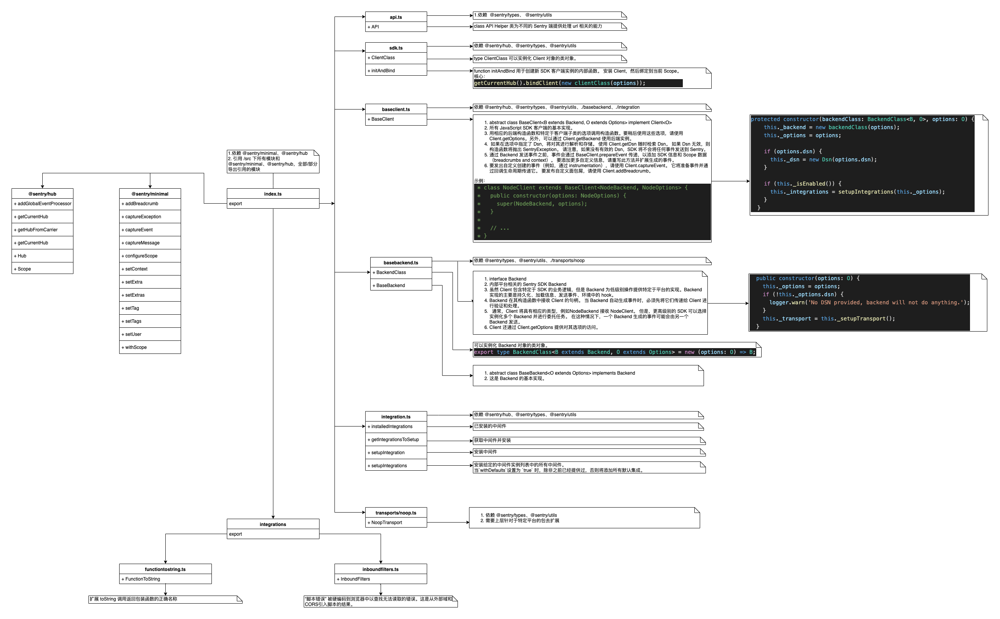
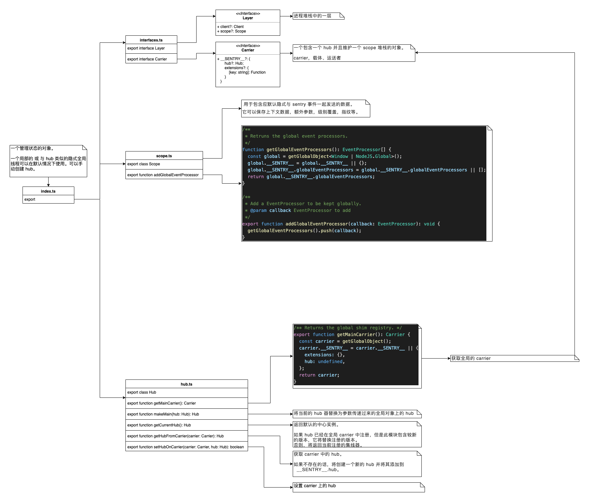
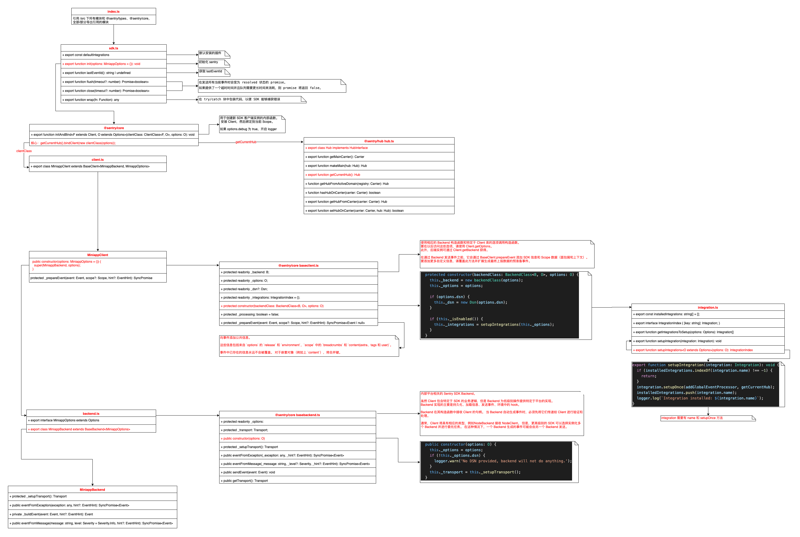

# Sentry Miniapp SDK


基于 `@sentry/core` 9.38.0 的微信小程序异常监控 SDK。

## 特性

- 🚀 基于最新的 Sentry JavaScript SDK 9.x 版本
- 📱 支持微信小程序、支付宝小程序、字节跳动小程序等多平台
- 🔍 自动捕获 JavaScript 异常和未处理的 Promise 拒绝
- 🍞 自动记录面包屑（用户操作、网络请求、页面导航等）
- 📊 收集系统信息和设备信息
- 🎯 支持自定义错误过滤和数据处理
- 💪 TypeScript 支持
- ✅ 完善的测试覆盖率（274+ 测试用例）
- 🛡️ 稳定可靠的错误处理和去重机制
- 🔧 开发友好的调试和集成测试工具

## 安装

```bash
npm install sentry-miniapp
```

## 快速开始

### 1. 初始化 SDK

在小程序的 `app.js` 或 `app.ts` 中初始化 Sentry：

```javascript
import * as Sentry from 'sentry-miniapp';

// 在 App() 之前初始化
Sentry.init({
  dsn: 'YOUR_SENTRY_DSN_HERE',
  environment: 'production', // 或 'development'
  debug: false, // 开发环境可设置为 true
  
  // 小程序特有配置
  platform: 'wechat', // 'wechat' | 'alipay' | 'bytedance' | 'qq' | 'baidu'
  enableSystemInfo: true, // 是否收集系统信息
  enableUserInteractionBreadcrumbs: true, // 是否记录用户交互面包屑
  enableConsoleBreadcrumbs: true, // 是否记录控制台日志面包屑
  enableNavigationBreadcrumbs: true, // 是否记录导航面包屑
  
  // 采样率配置
  sampleRate: 1.0, // 错误采样率
  
  // 过滤配置
  beforeSend(event) {
    // 可以在这里过滤或修改事件
    return event;
  },
});

App({
  // 你的小程序配置
});
```

### 2. 手动捕获异常

```javascript
import * as Sentry from 'sentry-miniapp';

// 捕获异常
try {
  // 可能出错的代码
  throw new Error('Something went wrong!');
} catch (error) {
  Sentry.captureException(error);
}

// 捕获消息
Sentry.captureMessage('用户执行了某个操作', 'info');

// 添加面包屑
Sentry.addBreadcrumb({
  message: '用户点击了按钮',
  category: 'ui',
  level: 'info',
  data: {
    buttonId: 'submit-btn'
  }
});

// 设置用户信息
Sentry.setUser({
  id: '12345',
  username: 'john_doe',
  email: 'john@example.com'
});

// 设置标签
Sentry.setTag('page', 'home');

// 设置上下文
Sentry.setContext('character', {
  name: 'Mighty Fighter',
  age: 19,
  attack_type: 'melee'
});
```

## 功能特点

- [x] 基于 [sentry-javascript 最新的基础模块](https://www.yuque.com/lizhiyao/dxy/zevhf1#0GMCN) 封装
- [x] 遵守[官方统一的 API 设计文档](https://www.yuque.com/lizhiyao/dxy/gc3b9r#vQdTs)，使用方式和官方保持一致
- [x] 使用 [TypeScript](https://www.typescriptlang.org/) 进行编写
- [x] 包含 Sentry SDK（如：[@sentry/browser](https://github.com/getsentry/sentry-javascript/tree/master/packages/browser)）的所有基础功能
- [x] 支持 `ES6`、`CommonJS` 两种模块系统（支持小程序原生开发方式、使用小程序框架开发方式两种开发模式下使用）
- [x] 默认监听并上报小程序的 onError、onUnhandledRejection、onPageNotFound、onMemoryWarning 事件返回的信息（各事件支持程度与对应各小程序官方保持一致）
- [x] 默认上报运行小程序的设备、操作系统、应用版本信息
- [x] 支持微信小程序
- [x] 支持微信小游戏
- [x] 支持字节跳动小程序
- [x] 支持支付宝小程序
- [x] 支持钉钉小程序
- [x] 支持百度小程序
- [x] 支持在 [Taro](https://taro.aotu.io/) 等第三方小程序框架中使用
- [x] 默认上报异常发生时的路由栈
- [x] 完善的代码测试覆盖率（274+ 测试用例，覆盖核心功能模块）
- [x] 智能错误去重和过滤机制
- [x] 完整的集成测试套件

## 用法

支持两种使用方式：

- 直接引用
- 通过 npm 方式使用（推荐）

### 注意

1. 无论选择哪种使用方式，都需要开启「微信开发者工具 - 设置 - 项目设置 - 增强编译」功能
2. 使用前需要确保有可用的 `Sentry Service`，比如：使用 [官方 Sentry Service](https://sentry.io/welcome/) 服务 或[自己搭建 Sentry Service](https://docs.sentry.io/server/)。如果想直接将异常信息上报到 <https://sentry.io/>，由于其没有备案，可以先将异常信息上报给自己已备案域名下的服务端接口，由服务端进行请求转发。
3. 在小程序管理后台配置 `Sentry Service` 对应的 `request` 合法域名

### 直接引用

1. 微信小程序和微信小游戏下载 [sentry-miniapp.wx.min.js](https://github.com/lizhiyao/sentry-miniapp/blob/master/examples/weapp/vendor/sentry-miniapp.wx.min.js)；字节跳动小程序下载 [sentry-miniapp.tt.min.js](https://github.com/lizhiyao/sentry-miniapp/blob/master/examples/ttapp/vendor/sentry-miniapp.tt.min.js)；支付宝小程序下载 [sentry-miniapp.my.min.js](https://github.com/lizhiyao/sentry-miniapp/blob/master/examples/myapp/vendor/sentry-miniapp.my.min.js)，钉钉小程序下载 [sentry-miniapp.dd.min.js](https://github.com/lizhiyao/sentry-miniapp/blob/master/examples/ddapp/vendor/sentry-miniapp.dd.min.js)
2. 参照 `/examples` 中各项目使用方式，将 `sentry-miniapp.xx.min.js` 放入项目的合适目录中，比如放入 `vendor` 文件夹
3. 参照 `/examples/app.js` 代码，进行 `Sentry` 的初始化
4. 对于提供了微信、字节跳动小程序 `sentry-miniapp` 会自动上报 `xx.onError()` 捕获的异常，对于支付宝小程序需要应用开发者在 `App.onError()` 中主动进行异常上报。详情可见 `/docs/cross-platform.md`。

### npm 方式

注意：目前字节跳动小程序不支持 npm 方式。

1. 安装依赖

   ```bash
   npm install sentry-miniapp --save
   # 或者
   yarn add sentry-miniapp
   ```

2. 使用「微信开发者工具 - 工具 - 构建 npm」进行构建，详情可参考[npm 支持](https://developers.weixin.qq.com/miniprogram/dev/devtools/npm.html)

3. 在 `app.js` 中引用并初始化 `Sentry`，根据实际需求设置上报到 Sentry 的元信息

   ```js
   import * as Sentry from "sentry-miniapp";

   // init Sentry
   // init options: https://github.com/getsentry/sentry-javascript/blob/master/packages/types/src/options.ts
   Sentry.init({
     dsn: "__DSN__",
     // ...
   });

   // Set user information, as well as tags and further extras
   Sentry.configureScope((scope) => {
     scope.setExtra("battery", 0.7);
     scope.setTag("user_mode", "admin");
     scope.setUser({ id: "4711" });
     // scope.clear();
   });

   // Add a breadcrumb for future events
   Sentry.addBreadcrumb({
     message: "My Breadcrumb",
     // ...
   });

   // Capture exceptions, messages or manual events
   Sentry.captureException(new Error("Good bye"));
   Sentry.captureMessage("Hello, world!");
   Sentry.captureEvent({
     message: "Manual",
     stacktrace: [
       // ...
     ],
   });
   ```

## 开发

### 知识储备

开发前请仔细阅读下面内容：

- [sentry-javascript README 中文版](https://www.yuque.com/lizhiyao/dxydance/sentry-javascript-readme-cn)
- [Sentry 开发指南](https://www.yuque.com/lizhiyao/dxydance/sentry-develop-guide)
- [sentry-javascript 源码阅读](https://www.yuque.com/lizhiyao/dxydance/sentry-javascript-src)

#### sentry-core 设计图



#### sentry-hub 设计图



#### sentry-miniapp 设计图



### 相关命令

```bash
# 开发相关命令
npm run dev                    # 启动开发模式（监听文件变化）
npm run build:miniapp          # 构建小程序开发版本
npm run build                  # 构建生产版本
npm run build:types            # 构建类型定义文件

# 测试相关命令
npm test                       # 运行完整测试套件（274+ 测试用例）
npm run test:watch             # 监听模式运行测试
npm run test:coverage          # 生成测试覆盖率报告
npm run test:integration       # 运行集成测试

# 代码质量
npm run lint                   # 代码检查
npm run lint:fix               # 自动修复代码问题

# 构建相关命令
npm run build:dist             # 构建供小程序直接引用的文件
npm run build:wx               # 构建微信小程序版本
npm run build:my               # 构建支付宝小程序版本
npm run build:dd               # 构建钉钉小程序版本
npm run build:tt               # 构建字节跳动小程序版本
npm run build:swan             # 构建百度小程序版本
npm run build:esm              # 构建 ESM 模块

# 版本管理
npm run version                # 更新版本号
npm publish --registry=https://registry.npmjs.org/  # 发布到 npm
```

## 效果图


## 谁在使用 sentry-miniapp

### 微信小程序

- 丁香医生
- 丁香医生医生端
- 丁香人才
- 丁香家

### 支付宝小程序

- 丁香医生

### 字节跳动小程序

- 丁香医生

## 参考资料

- [sentry-javascript](https://github.com/getsentry/sentry-javascript)
- [Sentry Getting Started](https://docs.sentry.io/error-reporting/quickstart/?platform=browsernpm)
- [Sentry JavaScript SDKs](http://getsentry.github.io/sentry-javascript/)
- [Sentry TypeScript Configuration](https://github.com/getsentry/sentry-javascript/tree/master/packages/typescript)
- [wx.request](https://developers.weixin.qq.com/miniprogram/dev/api/network/request/wx.request.html)
- [小程序 App](https://developers.weixin.qq.com/miniprogram/dev/reference/api/App.html)
- [wx.onError、App.onError 疑惑及如何捕获 Promise 异常？](https://developers.weixin.qq.com/community/develop/doc/000c8cf5794770272709f38a756000)
- [shields.io](https://shields.io/)
- [字节跳动小程序文档](https://developer.toutiao.com/docs/framework/)
- [支付宝小程序文档](https://docs.alipay.com/mini/developer)
- [tt.onError 的疑问](http://forum.microapp.bytedance.com/topic/2806/tt-onerror-%E7%96%91%E9%97%AE)

## 其他小程序异常监控产品

- [Fundebug](https://www.fundebug.com/)
- [FrontJS](https://www.frontjs.com/home/tour)
- [Bugout](https://bugout.testin.cn/)

## 贡献

欢迎通过 `issue`、`pull request` 等方式贡献 `sentry-miniapp`。

### 贡献指南

1. **Fork 项目并创建分支**
   ```bash
   git clone https://github.com/your-username/sentry-miniapp.git
   git checkout -b feature/your-feature-name
   ```

2. **安装依赖并设置开发环境**
   ```bash
   npm install
   npm run dev  # 启动开发模式
   ```

3. **编写代码和测试**
   - 修改 `src/` 目录下的源码
   - 为新功能添加相应的测试用例
   - 确保测试覆盖率不降低

4. **运行测试和检查**
   ```bash
   npm test                # 运行完整测试套件
   npm run lint            # 代码风格检查
   npm run build:miniapp   # 验证构建
   ```

5. **在示例项目中验证**
   - 在 `examples/wxapp` 中测试新功能
   - 确保在真实小程序环境中正常工作

6. **提交 Pull Request**
   - 提供清晰的变更说明
   - 包含测试用例和文档更新
   - 确保所有 CI 检查通过

### 测试要求

- 新功能必须包含相应的单元测试
- 测试覆盖率应保持在高水平
- 集成测试应验证端到端功能
- 所有测试必须通过才能合并

## 联系作者

PS. 由于微信群二维码有时效性限制，想入群的同学还可以加作者微信（添加时请备注 sentry-miniapp），由作者邀请入群

### sentry-miniapp 微信交流群


### 作者微信二维码


