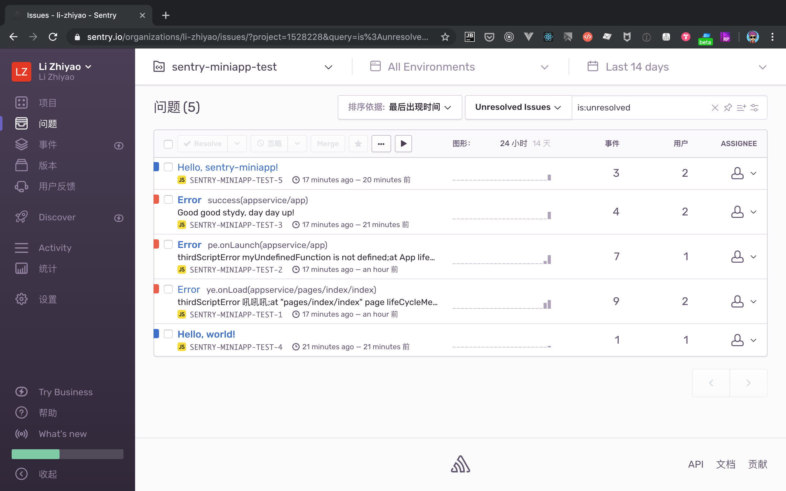
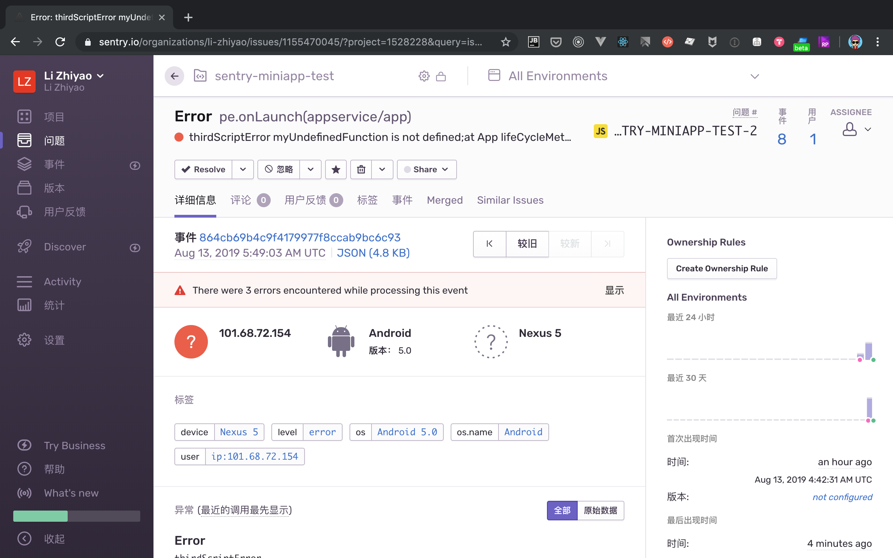
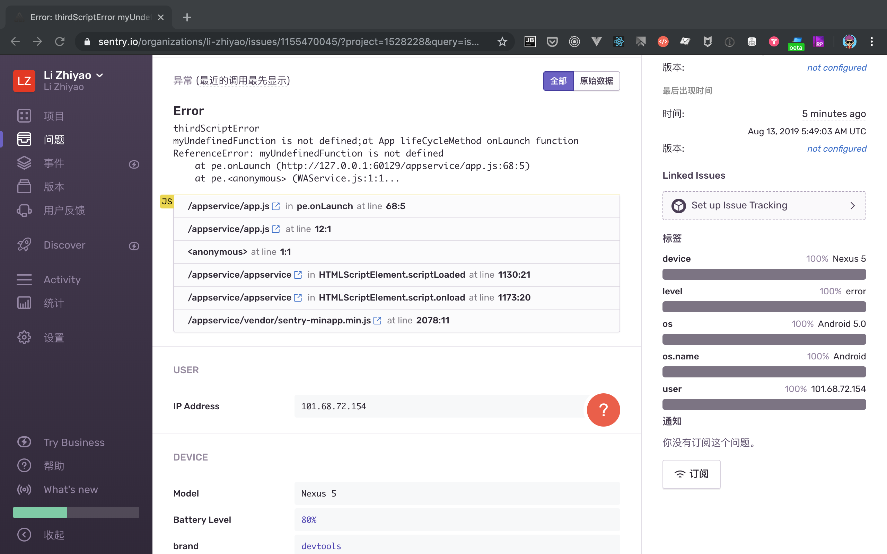
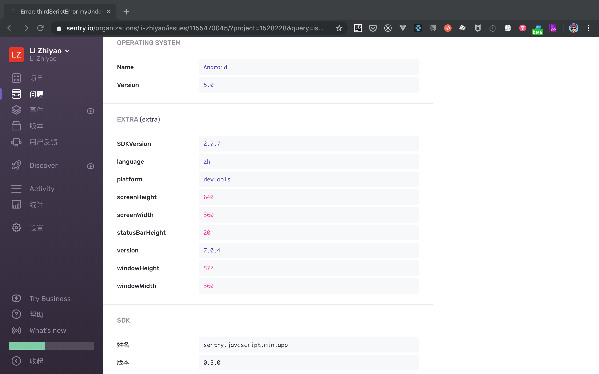

# Sentry 小程序 SDK


用于小程序平台的 Sentry SDK

## 功能特点

- [x] 基于 [sentry-javascript 最新的基础模块](https://www.yuque.com/lizhiyao/dxy/zevhf1#0GMCN) 封装
- [x] 遵守[官方统一的 API 设计文档](https://www.yuque.com/lizhiyao/dxy/gc3b9r#vQdTs)，使用方式和官方保持一致
- [x] 使用 [TypeScript](https://www.typescriptlang.org/) 进行编写
- [x] 包含 Sentry SDK（如：[@sentry/browser](https://github.com/getsentry/sentry-javascript/tree/master/packages/browser)）的所有基础功能
- [x] 支持 `ES6`、`CommonJS` 两种模块系统 ---> 支持小程序原生开发方式、使用小程序框架开发方式两种开发模式下使用
- [x] 默认监听并上报小程序的 onError、onPageNotFound、onMemoryWarning 事件返回的信息
- [x] 默认上报运行小程序的设备、操作系统、应用版本信息
- [ ] 完善的代码测试
- [ ] 支持支付宝小程序、字节跳动小程序

## 用法

支持两种使用方式：

- 直接引用
- 通过 npm 方式使用（推荐）

### 注意

1. 无论选择哪种使用方式，都需要开启「微信开发者工具 - 设置 - 项目设置 - 增强编译」功能
2. 使用前需要确保有可用的 `Sentry Service`，比如：使用 [官方 Sentry Service](https://sentry.io/welcome/) 服务 或[自己搭建 Sentry Service](https://docs.sentry.io/server/)
3. 在小程序管理后台配置 `Sentry Service` 对应的 `request` 合法域名

### 直接引用

1. 下载 [sentry-minapp.min.js](https://github.com/lizhiyao/sentry-miniapp/blob/master/examples/vendor/sentry-minapp.min.js)
2. 参照 `/examples` 中方式，将 `sentry-minapp.min.js` 放入项目的合适目录中，比如放入 `vendor` 文件夹
3. 参照 `/examples/app.js` 代码，进行 `Sentry` 的初始化

### npm 方式

1. 安装依赖

   ```bash
   npm install sentry-miniapp --save
   # 或者
   yarn add sentry-miniapp
   ```

2. 使用「微信开发者工具 - 工具 - 构建 npm」进行构建，详情可参考[npm 支持](https://developers.weixin.qq.com/miniprogram/dev/devtools/npm.html)

3. 在 `app.js` 中引用并初始化 `Sentry`，根据实际需求设置上报到 Sentry 的元信息

   ```js
   import * as Sentry from "sentry-miniapp";

   // init Sentry
   // init options: https://github.com/getsentry/sentry-javascript/blob/master/packages/types/src/options.ts
   Sentry.init({
     dsn: "__DSN__"
     // ...
   });

   // Set user information, as well as tags and further extras
   Sentry.configureScope(scope => {
     scope.setExtra("battery", 0.7);
     scope.setTag("user_mode", "admin");
     scope.setUser({ id: "4711" });
     // scope.clear();
   });

   // Add a breadcrumb for future events
   Sentry.addBreadcrumb({
     message: "My Breadcrumb"
     // ...
   });

   // Capture exceptions, messages or manual events
   Sentry.captureException(new Error("Good bye"));
   Sentry.captureMessage("Hello, world!");
   Sentry.captureEvent({
     message: "Manual",
     stacktrace: [
       // ...
     ]
   });
   ```

## 开发

### 知识储备

开发前请仔细阅读下面内容：

- [sentry-javascript README 中文版](https://www.yuque.com/lizhiyao/dxy/zevhf1)
- [Sentry 开发指南](https://www.yuque.com/lizhiyao/dxy/gc3b9r)
- [sentry-javascript 源码阅读](https://www.yuque.com/lizhiyao/dxy/xn8e4m)

### 相关命令

```bash
# 根据 package.json 中的版本号更新 SDK 源码中的版本号
npm run version

# 构建供小程序直接引用的 sentry-minapp.min.js；在本地可直接使用开发者工具打开 examples 下具体项目进行调试
npm run build:dev

# 构建用于发布到 npm 的 dist 资源
npm run build

# 发布到 npm
npm publish
```

## 效果图






## 谁在使用 sentry-miniapp

- 丁香医生微信小程序
- 丁香医生医生端微信小程序
- 丁香人才微信小程序

## 参考资料

- [sentry-javascript](https://github.com/getsentry/sentry-javascript)
- [Sentry Getting Started](https://docs.sentry.io/error-reporting/quickstart/?platform=browsernpm)
- [Sentry JavaScript SDKs](http://getsentry.github.io/sentry-javascript/)
- [Sentry TypeScript Configuration](https://github.com/getsentry/sentry-javascript/tree/master/packages/typescript)
- [wx.request](https://developers.weixin.qq.com/miniprogram/dev/api/network/request/wx.request.html)
- [小程序 App](https://developers.weixin.qq.com/miniprogram/dev/reference/api/App.html)
- [wx.onError、App.onError疑惑及如何捕获Promise异常？](https://developers.weixin.qq.com/community/develop/doc/000c8cf5794770272709f38a756000)
- [shields.io](https://shields.io/)

## 其他小程序异常监控产品

- [Fundebug](https://www.fundebug.com/)
- [FrontJS](https://www.frontjs.com/home/tour)
- [Bugout](https://bugout.testin.cn/)

## 贡献

欢迎通过 `issue`、`pull request`等方式贡献 `sentry-miniapp`。

## 联系作者

### 作者博客

- [博客](https://lizhiyao.github.io/)

### 微信交流群


